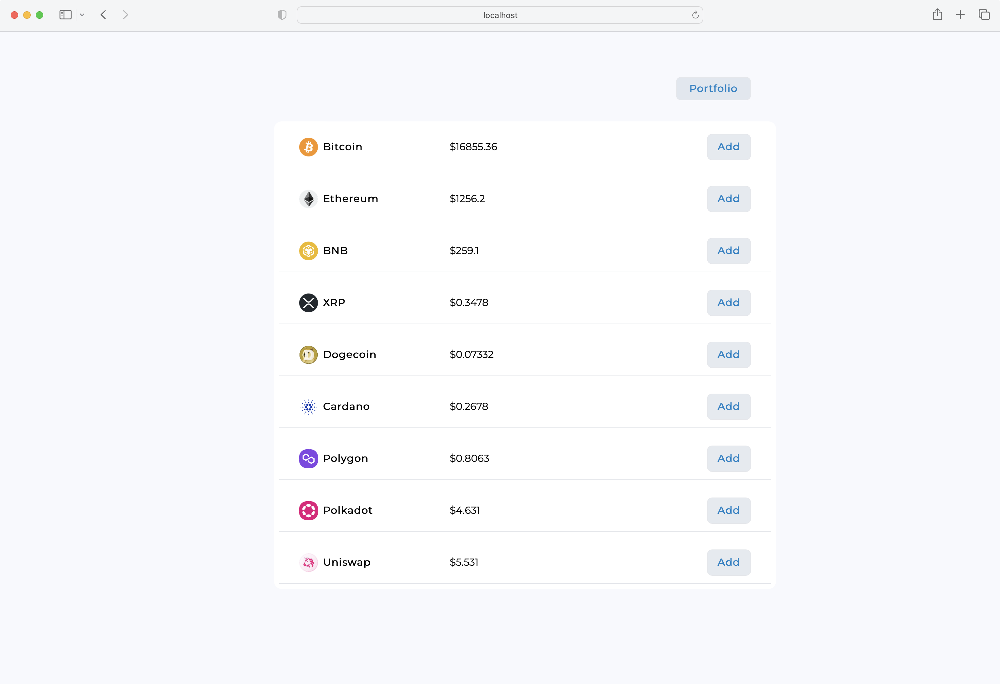
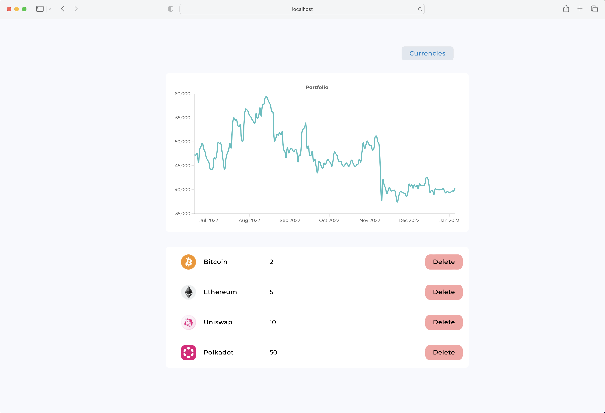

# crypto-tracker
track and visualize crypto investments

## Features

* [x] CRUD functionality: add, read, update, delete your portfolio assets
* [x] Price chart visualization with [Chart.js](https://github.com/chartjs/Chart.js)
* [x] All data is stored in PostgreSQL 
* [ ] Code review / optimization
* [ ] Indicators for evaluating portfolio quality
* [ ] Add more cryptocurrenices, more indicators and automate parsing
* [ ] Distribute app as a docker image
* [ ] Ability to add multiple portfolios
* [ ] User authorization
* [ ] ...


## Screenshots





## Requirements
[docker](https://www.docker.com)

## Installation
1. clone the repository
```
git clone https://github.com/fidesy/crypto-tracker.git
```

2. pull and run PostgreSQL image
```
docker pull postgres
docker run --name exampledb -e POSTGRES_PASSWORD=postgres -dp 5432:5432 postgres
```

3. activate python environment
```
python3 -m venv venv
source venv/bin/activate
pip install -r requirements.txt
```

4. run fastapi application
```
make run

OR

python -m uvicorn crypto_tracker.main:app --reload
```

5. fill in data in tables
```
python crypto_tracker/scripts/insert_currencies.py
python crypto_tracker/scripts/parse_candlesticks.py
```

6. install interface dependecies and run it
```
cd interface
npm i
npm start
```